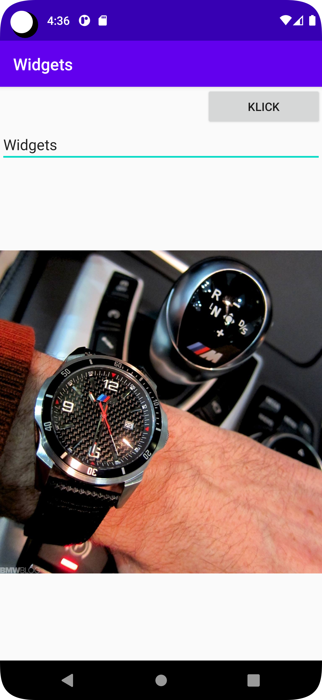

# Rapport

I started executing the task before the second part of the lecture started, so I did it without seeing the demo.
I started with LinearLayout and then added the following
<EditText
android:layout_width="match_parent"
android:layout_height="wrap_content"
android:text="@string/app_name" />
Then I chose a picture and added it

<ImageView
android:layout_width="match_parent"
android:layout_height="wrap_content"
app:srcCompat="@drawable/bmw" />

Then I added a button called Klick
<Button
android:layout_width="142dp"
android:layout_height="wrap_content"
android:layout_gravity="right"
android:text="Klick" />


When the session began, I asked the professor if what I had done was correct, and I learned that I can change the arrangement in more than one way. For example, if I want to switch between the location of the image and Widgets, I can change the arrangement of the code or by dragging from the location of the design, and it was a fun and amazing thing.
I made the button at the top to the right, then EditText comes after it, and the image is the last thing.


## kod


```
 <Button
        android:layout_width="142dp"
        android:layout_height="wrap_content"
        android:layout_gravity="right"
        android:text="Klick" />
```

```
<EditText
        android:layout_width="match_parent"
        android:layout_height="wrap_content"
        android:text="@string/app_name" />
```

```
<ImageView
        android:layout_width="match_parent"
        android:layout_height="wrap_content"
        app:srcCompat="@drawable/bmw" />
```

Photo



